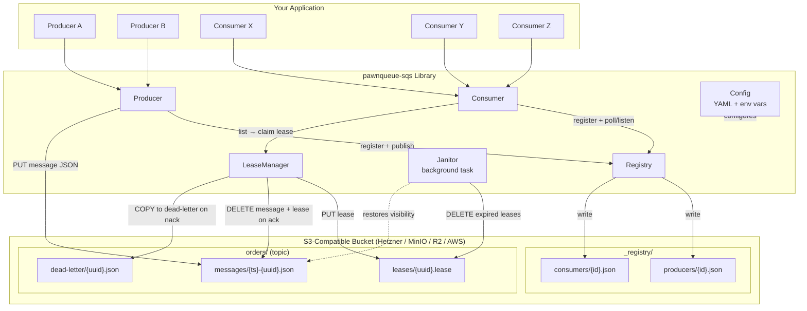
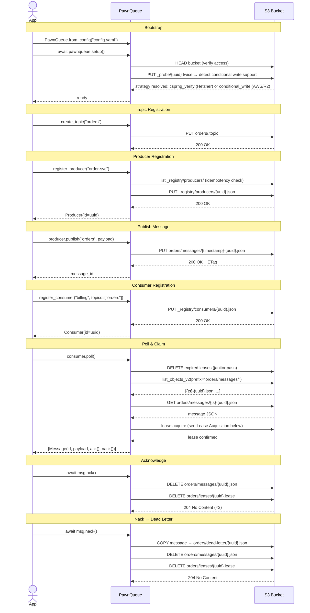
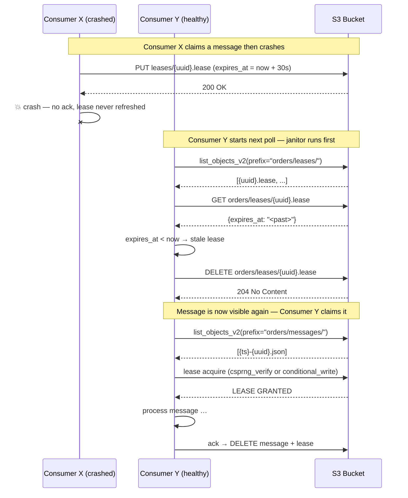

# pawn-queue

A pure-Python async pub/sub queue library that turns **any S3-compatible object store** into a lightweight message queue — no AWS account required, no message broker to deploy.

Works with [Hetzner Object Storage](https://www.hetzner.com/storage/object-storage), [MinIO](https://min.io), [Cloudflare R2](https://developers.cloudflare.com/r2/), [Backblaze B2](https://www.backblaze.com/cloud-storage), and AWS S3.

---

## Contents

- [pawn-queue](#pawn-queue)
  - [Contents](#contents)
  - [Quick Start](#quick-start)
  - [How It Works](#how-it-works)
  - [Architecture](#architecture)
    - [Bucket Layout](#bucket-layout)
    - [High-Level Architecture](#high-level-architecture)
    - [Full Publish → Consume Sequence](#full-publish--consume-sequence)
    - [Lease Acquisition — Both Strategies](#lease-acquisition--both-strategies)
    - [Crash Recovery via Janitor](#crash-recovery-via-janitor)
    - [listen() Internal Task Structure](#listen-internal-task-structure)
  - [Concurrency \& Safety](#concurrency--safety)
    - [Strategy: `conditional_write`](#strategy-conditional_write)
    - [Strategy: `csprng_verify` (default for Hetzner/Ceph)](#strategy-csprng_verify-default-for-hetznerceph)
    - [Automatic Strategy Detection](#automatic-strategy-detection)
  - [Configuration](#configuration)
  - [API Reference](#api-reference)
    - [`PawnQueue`](#pawnqueue)
    - [`Producer`](#producer)
    - [`Consumer`](#consumer)
    - [`Message`](#message)
  - [Installation](#installation)
  - [Running Tests](#running-tests)
    - [Unit Tests](#unit-tests)
    - [E2E Tests (Hetzner)](#e2e-tests-hetzner)
  - [Idempotency Recommendation](#idempotency-recommendation)
  - [License](#license)

---

## Quick Start

```python
import asyncio
from pawn_queue import PawnQueue

async def main():
    async with await PawnQueue.from_config("config.yaml") as pawnqueue:
        # 1. Register a topic (folder in S3)
        await pawnqueue.create_topic("orders")

        # 2. Publish messages
        producer = await pawnqueue.register_producer("order-service")
        await producer.publish("orders", {"order_id": 42, "item": "widget"})

        # 3. Consume — pull mode
        consumer = await pawnqueue.register_consumer("billing", topics=["orders"])
        messages = await consumer.poll()
        for msg in messages:
            print(msg.payload)   # {"order_id": 42, "item": "widget"}
            await msg.ack()      # removes from queue

asyncio.run(main())
```

```python
# Push mode — runs until cancelled
async def handler(msg):
    print(msg.payload)
    await msg.ack()

await consumer.listen(handler)
```

---

## How It Works

| Concept | S3 representation |
|---|---|
| **Topic** | A "folder" prefix `{topic}/`, marked by `{topic}/.topic` |
| **Message** | `{topic}/messages/{timestamp}-{uuid}.json` |
| **Claim / Lease** | `{topic}/leases/{msg-uuid}.lease` |
| **Dead Letter** | `{topic}/dead-letter/{msg-uuid}.json` |
| **Producer registration** | `_registry/producers/{producer-id}.json` |
| **Consumer registration** | `_registry/consumers/{consumer-id}.json` |

- Message keys are prefixed with a UTC timestamp so `list_objects_v2` returns them in **FIFO order** natively.
- Every producer and consumer gets a **stable UUIDv4** at registration time, persisted in S3. Re-registering with the same name is idempotent — the same ID is returned.
- Concurrency is resolved entirely through S3 primitives: no Redis, no ZooKeeper, no sidecar process.

---

## Architecture

### Bucket Layout

```
{bucket}/
├── _registry/
│   ├── producers/{producer-uuid}.json
│   └── consumers/{consumer-uuid}.json
│
├── {topic}/
│   ├── .topic                              ← marker: topic exists
│   ├── messages/{ts}-{uuid}.json          ← pending messages (FIFO by key)
│   ├── leases/{uuid}.lease                ← active claim records
│   └── dead-letter/{uuid}.json            ← nacked / failed messages
│
└── _probe/{uuid}.probe                     ← temporary: compat probe only
```

---

### High-Level Architecture



---

### Full Publish → Consume Sequence



---

### Lease Acquisition — Both Strategies

```mermaid
sequenceDiagram
    participant C as Consumer
    participant S3 as S3 Bucket

    alt Strategy: conditional_write (AWS S3 / Cloudflare R2)
        C->>S3: PUT leases/{uuid}.lease<br/>[If-None-Match: *]
        alt Nobody else claimed first
            S3-->>C: 201 Created → LEASE GRANTED
        else Another consumer beat us
            S3-->>C: 412 PreconditionFailed → BACK OFF
        end

    else Strategy: csprng_verify (Hetzner / Ceph / MinIO / everyone else)
        C->>C: nonce = secrets.token_bytes(32)<br/>lease_bytes = canonical_json(nonce, consumer_id, expires_at)<br/>expected_etag = MD5(lease_bytes)
        Note over C,S3: Step 1 — write (last writer wins; winner unknown yet)
        C->>S3: PUT leases/{uuid}.lease<br/>[body = lease_bytes, no condition header]
        S3-->>C: 200 OK
        Note over C,S3: Step 2 — jitter: let all concurrent PUT requests reach S3
        C->>C: sleep(random jitter 100–400 ms)
        Note over C,S3: Step 3 — verify (repeated verify_retries times)
        C->>S3: HEAD leases/{uuid}.lease
        S3-->>C: ETag: "{stored_md5}"

        alt stored ETag == expected_etag  (our bytes survived all rounds)
            C->>C: sleep(verify_retry_delay_ms)
            C->>S3: HEAD leases/{uuid}.lease  (re-verify, verify_retries rounds)
            S3-->>C: ETag: "{stored_md5}"  still ours
            Note over C,S3: Step 4 — post-verify confirmation<br/>(guards against late-arriving competitor writes)
            C->>C: sleep(jitter_min_ms)
            C->>S3: HEAD leases/{uuid}.lease  (final confirmation HEAD)
            S3-->>C: ETag: "{stored_md5}"
            alt final ETag still ours
                C-->>C: LEASE GRANTED ✓
            else final ETag changed (late write arrived after step 3)
                C-->>C: BACK OFF — late competitor write detected
            end
        else stored ETag ≠ expected_etag  (another consumer's bytes survived)
            C-->>C: BACK OFF — another consumer won
        end
    end
```

**Why `csprng_verify` is safe:**

Two consumers always write *different* bytes because each generates a unique 256-bit CSPRNG nonce (collision probability ≈ 2⁻²⁵⁶). S3 last-write-wins semantics mean exactly one set of bytes survives. Because Hetzner provides **read-after-write consistency**, the `HEAD` response always reflects the surviving write.

**The late-write edge case (and how it is closed):** In steps 1–3, a consumer whose PUT arrives at S3 *after* a competitor has already passed all verify rounds can silently overwrite the lease — giving two consumers the impression that their own bytes survived. Step 4 (post-verify confirmation) closes this window: after all retry-HEADs succeed, the winning consumer sleeps for `jitter_min_ms` (≥ network one-way latency) and then performs one final `HEAD`. Any late write that arrived at S3 during the step-3 verification window will now be visible, and the losing consumer backs off.

---

### Crash Recovery via Janitor



Lease TTL is controlled by `polling.visibility_timeout_seconds` (default: 30 s). Active consumers renew their lease every `polling.lease_refresh_interval_seconds` (default: 10 s) via the background `_lease_refresher` task.

---

### listen() Internal Task Structure

```mermaid
graph LR
    subgraph asyncio_Event_Loop["asyncio Event Loop"]
        LISTEN["consumer.listen(handler)"]
        POLL["_poll_loop()\ncall poll() on interval\nyield messages"]
        REFRESH["_lease_refresher()\nre-PUT lease every N sec\nextends expires_at"]
        HANDLER["handler(msg)\nuser callback"]
    end

    LISTEN -->|asyncio.gather| POLL
    LISTEN -->|asyncio.gather| REFRESH
    POLL -->|for each claimed msg| HANDLER
    HANDLER -->|msg.ack()\nor msg.nack()| S3[(S3 Bucket)]
    REFRESH -->|PUT lease refresh| S3
    LISTEN -->|"cancelled on\nKeyboardInterrupt\nor task.cancel()"| POLL & REFRESH
```

`listen()` runs until the task is cancelled (e.g., `Ctrl-C`). If the handler raises an exception, `nack()` is called automatically to move the message to dead-letter.

---

## Concurrency & Safety

### Strategy: `conditional_write`

Uses the `If-None-Match: *` request header on `PutObject`.

- **Backend support:** AWS S3 (≥ Aug 2024), Cloudflare R2. **Not** Hetzner/Ceph.
- **Guarantee:** Atomic. Exactly one writer succeeds; all others receive `412 PreconditionFailed`.
- **No jitter needed.**

### Strategy: `csprng_verify` (default for Hetzner/Ceph)

A cryptographic compare-and-swap protocol using S3 ETags. See the [Lease Acquisition diagram](#lease-acquisition--both-strategies).

| Property | Details |
|---|---|
| **Nonce entropy** | 256 bits — `secrets.token_bytes(32)` |
| **Collision probability** | ≈ 2⁻²⁵⁶ (negligible) |
| **Required S3 properties** | Last-write-wins + read-after-write consistency |
| **Works on Hetzner?** | ✅ Yes — Ceph RGW provides both |
| **Duplicate risk** | Closed by post-verify confirmation (Step 4) |

**4-step algorithm:**

1. **Write** — PUT the lease object (unique nonce bytes). S3 last-write-wins; the local winner is unknown.
2. **Jitter** — Sleep a random interval (`jitter_min_ms`–`jitter_max_ms`). This window must exceed the S3 network one-way latency so all concurrent PUT requests have time to arrive and be applied at S3 before verification begins.
3. **Verify** — HEAD the lease key `verify_retries + 1` times, checking that the stored ETag matches `MD5(our_bytes)`. Any mismatch means a competitor's write survived — back off immediately.
4. **Post-verify confirmation** — Sleep `jitter_min_ms` once more, then perform a final HEAD. This closes the *late-write window*: a competitor whose PUT was still in-flight during step 3 has now had time to reach S3. If the ETag changed, back off.

**The late-write edge case:** Without Step 4, a slow-network PUT from consumer B could arrive at S3 *after* consumer A completed all step-3 verifications. B then also passes its own verifications, giving both A and B the impression that they hold the lease — resulting in a duplicate delivery. Step 4 catches exactly this scenario.

**Tuning `jitter_min_ms`:** Set it to at least 2× the expected one-way network latency to S3. The default (100 ms) is appropriate for most European data-centre deployments. Reduce with caution on low-latency networks.

### Automatic Strategy Detection

When `concurrency.strategy = auto` (the default), the library runs a probe at startup:

1. Writes a probe object to `_probe/{uuid}.probe`.
2. Attempts a second write of the same key with `If-None-Match: *`.
3. If the second write fails with `412` → `conditional_write` selected.
4. If the second write succeeds silently → `csprng_verify` selected.
5. Probe object is deleted.

This selection is logged at `INFO` level and stored for the session lifetime.

---

## Configuration

Copy `config.example.yaml` and fill in your credentials:

```yaml
s3:
  endpoint_url: "https://fsn1.your-objectstorage.com"   # Hetzner FSN1
  bucket_name: "my-queue-bucket"
  aws_access_key_id: "..."
  aws_secret_access_key: "..."
  region_name: "eu-central-1"
  use_ssl: true

polling:
  interval_seconds: 5            # how often consumer.poll() loops in listen() mode
  max_messages_per_poll: 10      # max messages returned per poll() call
  visibility_timeout_seconds: 30 # lease TTL — message reappears if not acked within this time
  lease_refresh_interval_seconds: 10  # background task renews lease at this interval
  jitter_max_ms: 200             # unused in csprng_verify (has its own jitter config)

concurrency:
  strategy: "auto"               # auto | conditional_write | csprng_verify
  csprng_verify:
    jitter_min_ms: 100           # minimum write→verify sleep
    jitter_max_ms: 400           # maximum write→verify sleep
    verify_retries: 2            # number of additional HEAD re-checks
    verify_retry_delay_ms: 150   # sleep between re-checks

registry:
  heartbeat_interval_seconds: 60 # how often last_seen is updated in _registry/
```

**All `s3.*` values can be overridden by environment variables:**

| Env var | Config key |
|---|---|
| `PAWNQUEUE_S3_ENDPOINT_URL` | `s3.endpoint_url` |
| `PAWNQUEUE_S3_BUCKET_NAME` | `s3.bucket_name` |
| `PAWNQUEUE_S3_ACCESS_KEY` | `s3.aws_access_key_id` |
| `PAWNQUEUE_S3_SECRET_KEY` | `s3.aws_secret_access_key` |
| `PAWNQUEUE_S3_REGION` | `s3.region_name` |

---

## API Reference

### `PawnQueue`

```python
# Create from YAML file, dict, or PawnQueueConfig object
pawnqueue = await PawnQueue.from_config("config.yaml")

# Explicit lifecycle
await pawnqueue.setup()      # opens S3 connection, runs compat probe
await pawnqueue.teardown()   # closes connection

# Context manager (recommended)
async with await PawnQueue.from_config("config.yaml") as pawnqueue:
    ...

# Topics
await pawnqueue.create_topic("orders")          # idempotent
topics: list[str] = await pawnqueue.list_topics()

# Producers & consumers
producer = await pawnqueue.register_producer("my-service")    # idempotent by name
consumer = await pawnqueue.register_consumer("my-worker", topics=["orders", "events"])
```

### `Producer`

```python
producer.id    # stable UUIDv4
producer.name  # registration name

msg_id: str = await producer.publish("orders", {"key": "value"})
```

Raises `TopicNotFoundError` if the topic has not been registered. Raises `PublishError` on S3 failure.

### `Consumer`

```python
consumer.id    # stable UUIDv4
consumer.name  # registration name

# Pull mode
messages: list[Message] = await consumer.poll()

# Push mode (blocks until cancelled)
async def handler(msg: Message) -> None:
    await msg.ack()

await consumer.listen(handler)
```

### `Message`

```python
msg.id           # str — UUIDv4
msg.topic        # str
msg.producer_id  # str — the producer's UUID
msg.created_at   # str — ISO-8601 UTC timestamp
msg.payload      # dict — user-provided JSON

await msg.ack()   # deletes message + lease from S3
await msg.nack()  # copies to dead-letter, deletes message + lease
```

Calling `ack()` or `nack()` more than once is safe (subsequent calls are no-ops).

---

## Installation

```bash
pip install pawnqueue-sqs
```

**Runtime dependencies:** `aioboto3 >= 13`, `pydantic >= 2`, `pyyaml >= 6`

**Python:** 3.11+

---

## Running Tests

### Unit Tests

Uses `moto`'s `ThreadedMotoServer` — no real S3 account needed.

```bash
pip install -e ".[dev]"  # also installs flask, flask-cors for moto server
pytest tests/ -v
```

### E2E Tests (Hetzner)

Set credentials via environment variables or copy `e2e/config.template.yaml` to `e2e/config.yaml`:

```bash
export PAWNQUEUE_S3_ENDPOINT_URL=https://fsn1.your-objectstorage.com
export PAWNQUEUE_S3_BUCKET_NAME=your-existing-bucket
export PAWNQUEUE_S3_ACCESS_KEY=your-access-key
export PAWNQUEUE_S3_SECRET_KEY=your-secret-key
export PAWNQUEUE_S3_REGION=eu-central-1

pip install -e ".[e2e]"
pytest e2e/ -v --timeout=120
```

**Isolation:** E2E tests write under a unique `pawnqueue-e2e-{uuid}/` prefix per run and delete all created objects on teardown. Your existing bucket data is never touched.

**E2E test coverage:**

| File | What it tests |
|---|---|
| `test_e2e_compat_probe.py` | Strategy auto-detection; 10-way concurrent `csprng_verify` — exactly 1 winner |
| `test_e2e_topics.py` | Create, list, idempotency, ghost-topic error |
| `test_e2e_produce_consume.py` | Publish → poll → ack/nack/listen lifecycle end-to-end |
| `test_e2e_concurrency.py` | 20 msgs × 3 concurrent consumers — no duplicates, parametrized over both strategies |
| `test_e2e_registry.py` | 6 registrations, UUID uniqueness, idempotent re-registration |
| `test_e2e_dead_letter.py` | nack → dead-letter payload fidelity; mix of ack + nack |

---

## Idempotency Recommendation

The `csprng_verify` strategy provides strong exactly-once delivery guarantees through its 4-step cryptographic protocol (write → jitter → verify → post-verify confirmation). The post-verify confirmation step (Step 4) specifically closes the *late-write edge case* where a slow-network competitor PUT arrives at S3 after all verification rounds have passed.

However, network conditions are unbounded, and defensive programming is always valuable. Consumers **should still be idempotent** where the cost is low:

```python
async def handler(msg: Message) -> None:
    order_id = msg.payload["order_id"]

    # Idempotency guard: skip if already processed (e.g., checked in your DB)
    if await already_processed(order_id):
        await msg.ack()  # safe no-op — we already handled it
        return

    await process_order(order_id)
    await mark_processed(order_id)
    await msg.ack()
```

For **atomic** exactly-once semantics with no probabilistic component, use AWS S3 or Cloudflare R2 (both support `conditional_write`). The library selects this automatically when the backend supports it.

---

## License

MIT
